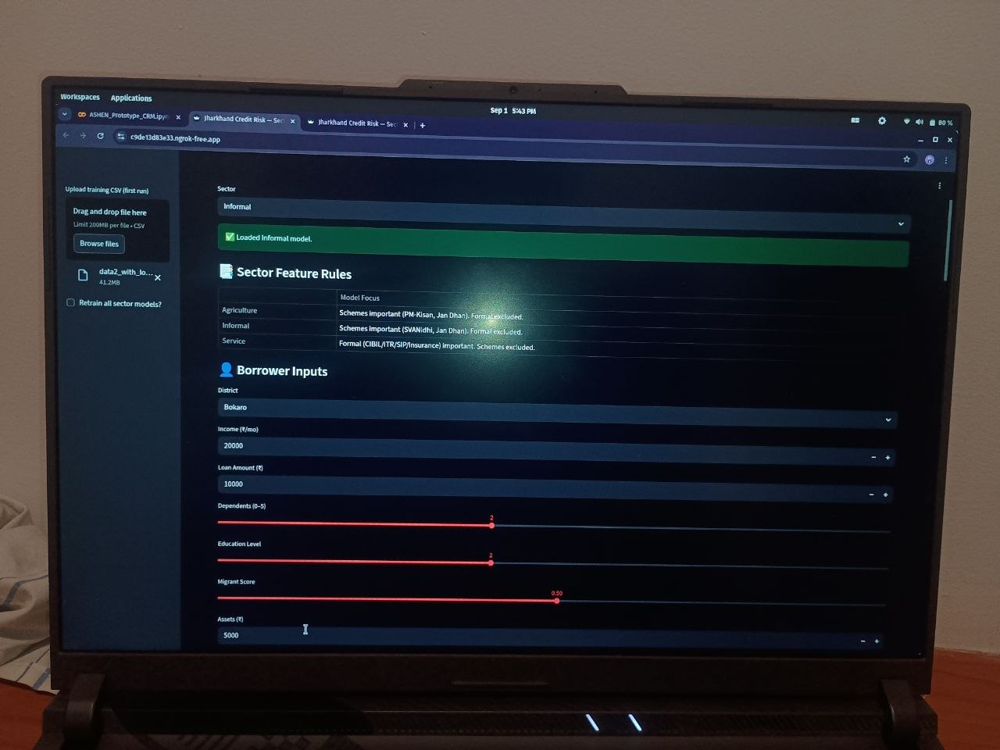

# FinShield Credit Risk Model
Alternative Credit Risk Model for underbanked borrowers in India.

This project was built during the **FinShield Hackathon organised by IIT Hyderabad (July 2025 – Sept 2025)**.
The model predicts **Probability of Default (PD)** for borrowers who lack traditional credit history using alternative financial indicators.

## Run the Project

Install dependencies and run:

streamlit run app.py

## Problem Statement

Traditional credit scoring relies heavily on formal credit history (CIBIL).
However, millions of borrowers in India are **credit invisible or underbanked**.

Banks struggle to assess their repayment capacity due to lack of financial records.

## Objectives

The model aims to:

- Use **alternative data sources**
- Adjust for **different economic sectors**
- Provide **transparent explanations** for credit decisions

## Key Innovations
### Sector-Specific Credit Logic

Borrower behavior differs across sectors.

|     Sector      |   Features Used    |
|
| Agriculture     | PM-Kisan, Jan Dhan |
| Informal Sector | Jan Dhan, SVANidhi |
| Service Sector  | Income, Assets     |

### LTI Multiplier (Loan-to-Income Constraint)

LTI = Loan Amount / Monthly Income

### Alternative Financial Signals

The model includes non-traditional indicators:

- Jan Dhan participation
- PM-Kisan scheme score
- SVANidhi score
- Telecom density
- Assets owned

### Explainability with SHAP

SHAP explains:

- Which features increase risk
- Which features reduce risk
- Why the model predicted a specific PD

## Deployment Architecture

Borrower → District → Zone → State → Core Banking System

## Tech Stack

- Python
- Scikit-learn
- Pandas
- SHAP
- Streamlit

## Future Work

- Core Banking System integration
- Government scheme APIs
- Larger borrower datasets
- Regional model calibration

## Sample Output

