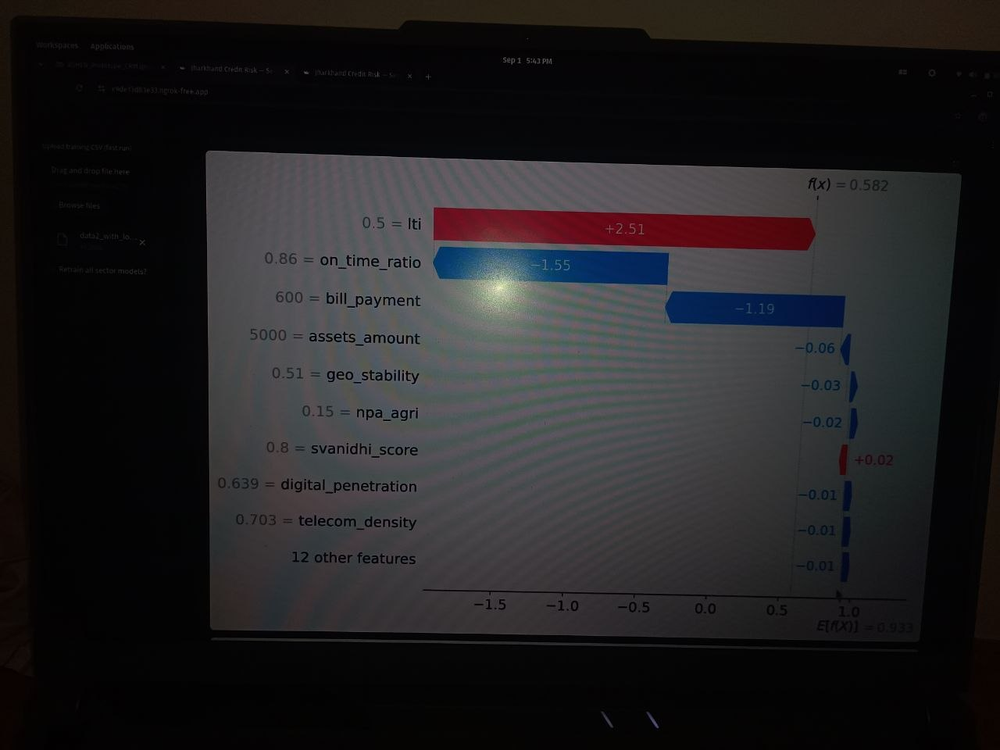
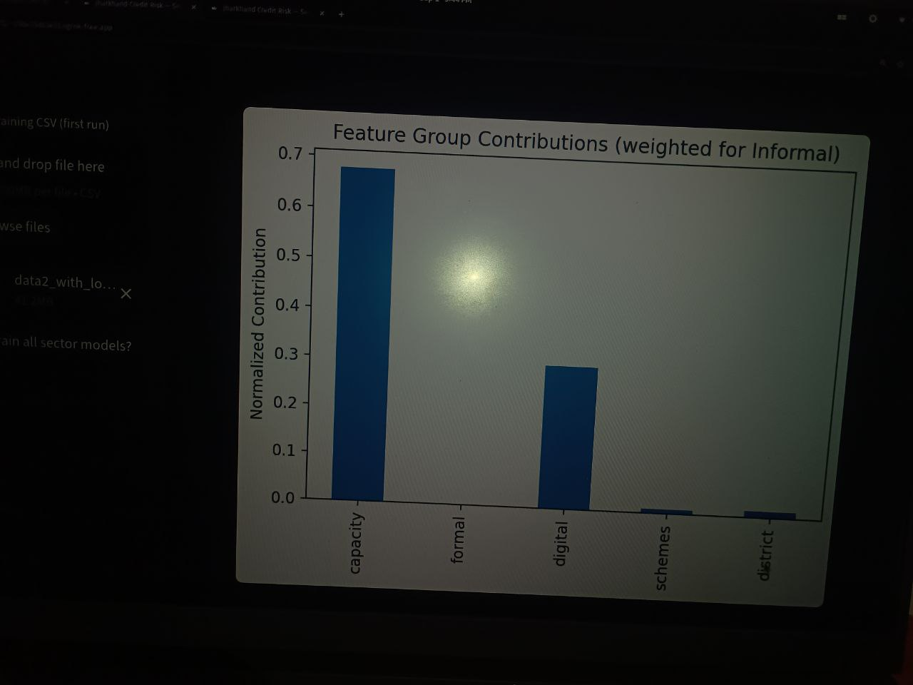

# FinShield Credit Risk Model
Alternative Credit Risk Model for underbanked borrowers in India.

This project was built during the **FinShield Hackathon organised by IIT Hyderabad (July 2025 – Sept 2025)**.
The model predicts **Probability of Default (PD)** for borrowers who lack traditional credit history using alternative financial indicators.
## Project Overview

This project demonstrates an alternative credit scoring approach
designed for underbanked populations in India.

Instead of relying only on traditional credit bureau scores,
the model evaluates borrowers using government scheme participation,
sector-specific indicators, and financial signals.

The system predicts **Probability of Default (PD)** and provides
**explainable insights using SHAP**.

## Run the Project

Install dependencies and run:

streamlit run app.py

## Problem Statement

Traditional credit scoring relies heavily on formal credit history (CIBIL).
However, millions of borrowers in India are **credit invisible or underbanked**.

Banks struggle to assess their repayment capacity due to lack of financial records.

## Objectives

The model aims to:

- Use **alternative data sources**
- Adjust for **different economic sectors**
- Provide **transparent explanations** for credit decisions

## Key Innovations
### Sector-Specific Credit Logic

Borrower behavior differs across sectors.
| Sector | Features Used |
|------|------|
| Agriculture | PM-Kisan, Jan Dhan |
| Informal Sector | Jan Dhan, SVANidhi |
| Service Sector | Income, Assets |

### LTI Multiplier (Loan-to-Income Constraint)

LTI = Loan Amount / Monthly Income

### Alternative Financial Signals

The model includes non-traditional indicators:

- Jan Dhan participation
- PM-Kisan scheme score
- SVANidhi score
- Telecom density
- Assets owned

### Explainability with SHAP

SHAP explains:

- Which features increase risk
- Which features reduce risk
- Why the model predicted a specific PD

## Model Workflow

1. Borrower inputs financial information
2. Sector-specific features are selected
3. ML model predicts Probability of Default (PD)
4. LTI multiplier adjusts risk based on loan affordability
5. SHAP explains which features influenced the decision

## Deployment Architecture

Borrower → District → Zone → State → Core Banking System

## Requirements

- Python 3.9+
- Streamlit
- Pandas
- Scikit-learn
- SHAP

## Tech Stack

- Python
- Scikit-learn
- Pandas
- SHAP
- Streamlit

## Future Work

- Core Banking System integration
- Government scheme APIs
- Larger borrower datasets
- Regional model calibration

## Sample Output

